## BMW SALES ANALYSIS REPORT

## PROJECT OVERVIEW

    This project analyses BMW sales report of 11 BMw car models over a period of 14 years.
    I used SQL for data exoploration while investigating revenue, sales and overall company growth -- hoping to find insights that would facilitate the company's growth.

## BUSINESS PROBLEM

We seek to understand the relationship between the different factors afecting the customer's choice of the used BMW vehicles in various regions to be enable to adequately channel out best efforts in the best places.

## DATASET OVERVIEW

- Total Rocords: 50,000
- Time Period: 2010 - 2024
- Unique Model: 11
- Regions explored: 6

## KEY COLLUMNS

- Model
- Year
- Fuel_type
- Transmision
- Engine Size
- price
- Sales
- Revenue

## DATA CLEANING AND VALIDATION

- Remove special characters
- Type conversion
- Checked for Nulls
- Checked duplicates
- Drop dirty tables and create new tables
- CTE
- SUBQUERIES
- WINDOW FUNCTIONS

## Tools and Skills

- SQL (For data exploration)
- Excel (Data inspection)
- Business insights

## DATA EXPLORATION

## REVENUE AND SALES

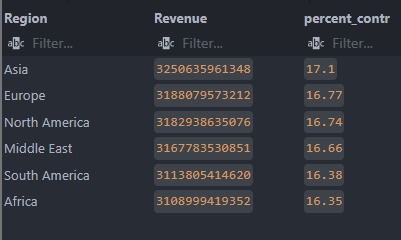

The ToTal Revenue for the period stood at Nineteen trillion, twelve billion, two hundred forty-two million, five hundred thirty-four thousand, four hundred fifty-nine Dollars.

### Total Sales

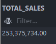

Total sales for the period under review stood at Two hundred fifty-three million, three hundred seventy-five thousand, seven hundred thirty-four.

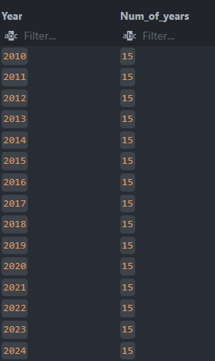  
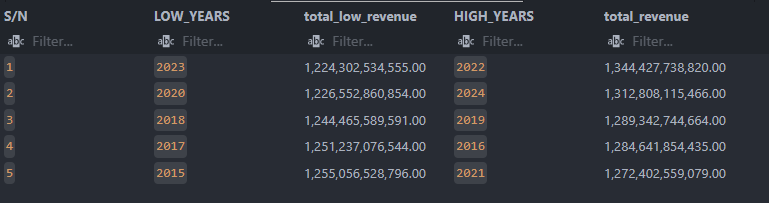

We review the period from 2010 to 2014

- 2022 had was the most profitable year while 2023 the next year had the worst revenue for the whole 14 years.

  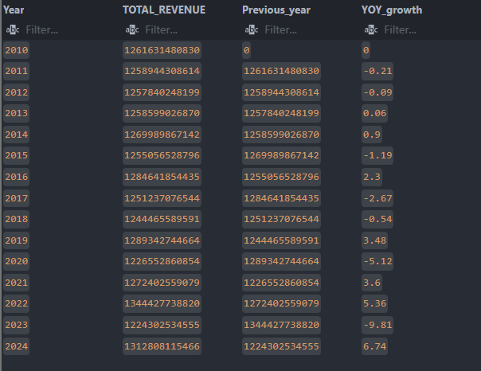

- The YoY growth shows initial negative growth index slight negligible growth and another turn negative and slight growth.

  

- the overall growth from comparing 2010 revenue to 2024 revenue stood at 4.06%.

    
   The data features Six(6) regions accross the world.

### TOTAL SALES AND REVENUE PER REGION

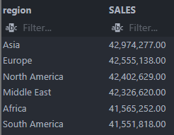  
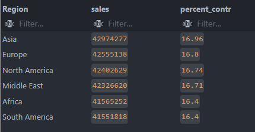  
  
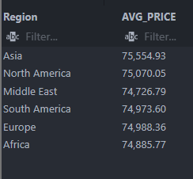

- The sales data shows no significant difference in the volume of sales between the reviewed region with all regions selling aba range of 41 million cars to 42 million.
- Asia recorded the highest sales and also the highest revenue with 17% contribution because of the higher average price of the vehicles in Asia.
- Even though Africa was number 5 in the sales ranking, Africa was last in the revenue ranking due to the lower cost of cars.
- Europe stood at rank 5 of the price ranking, however still the number 2 in revenue and sales contribution.  
  -Asia has the highest average price of vehicles signifying a higher premium purchase.

  

- The middle east made the highest progess in terms of growth by revenue with a 12.64% growth rate when comparing 2010 revenue to 2024 revenue.
- South America is the only region that made no progress, however recorded significant 5.28% negative growth.

- Africa's growth index remained almost the same with 0.29% change.

### MODELS

11 Models analysed  
  
  
  
  
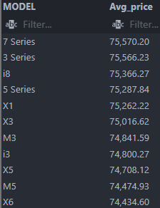

- A total of 11 models were reveiwed.
- The BMW 7 series made the highest sales while the M3 made the lowest sales.
- For revenue, the BMW M3 generated the lowest revneue while the BMW 7 series generated the highest revenue
- The pricing of the BMW 7 series was the highest in the average price per car ranking showing that price was not a determinatn of the purchase but possibly the quality and specification.
- The M3 whch had the lowest sales and revenue ranked 7th on the price scale. despite the relatively lower price, it still doesnt make much sales which indicates it is not a consumer favourite.

#### Model perfomance accross the Regions

**Africa**

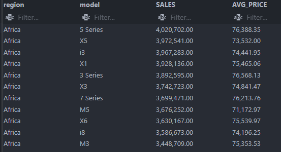

In Africa, the 5 series recorded the highest sales and the 2nd highest average price.

- The 7 series which was the number one in the global ranking ranked 7th in the African market with an average price ranking 3rd this shows that though it was not the consumer favourite in Africa as it perfomed significantly lower with lower price than a more expensive model.
- The 3 series had the highest price but had lower sales
- The M3 had the lowest sales in Africa as with the Global market.

**Asia**

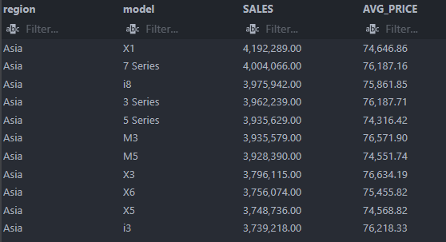

- In Asia, the XI model recorded the highest sales while the 7 series came 2nd.
- For pricing, the 7 series were a lot cheaper in Asia ranking number 5 in the average price scale.
- The Asia data shows that the M3 series perfomed relatively better than 5 other models despite having the 2nd highest average price -- suggesting a better acceptance in the Asia market.
  -- The highest selling car in Asia (the X1) had a relatively lower price than more 60% of the other models, suggesting that the Asian market may favour lower pricing vehicles.

**Europe**

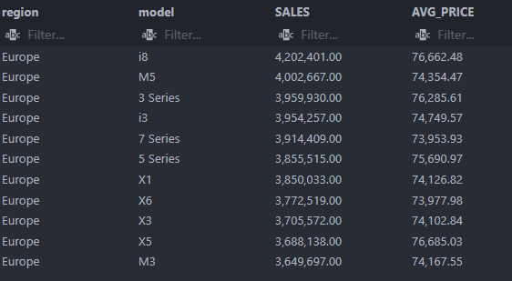

- In Europe, the i8 series had the highest sales with the second average price
- The x5 resies had the highest price and yet the 2nd lowest sales suggesting it is not a consumer favourite as it also ranks very low in the global sales performance.
- The M3 had the lowest sales, corresponding with the Global ranking.
- The 7 series had the lowest pricing in Europe while coming 5th in the sales ranking.
- The european data shows that sales are not majorly influenced by the pricing, but rather other qualities such as the specification of the vehicles themselves.

**Middle East**

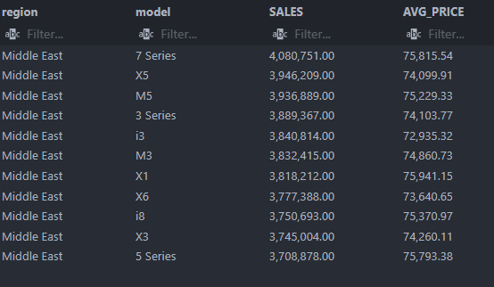

- 7 SERIES was the highest purchase in the middle east.
- x1 series however had the second highest price in the middle east with the X1 series sitting on top.
- The other models shows an influence of lower pricing to the sales volume. suggesting the market may tilt towards cars with lower price range.

**North America**

- The 7 series remained the favourite of North America followed by the X1.
- The 7 series had the highest average pricing while the x3 had the lowest pricing.
- The sales dataa slight relationship between models with middle ranged pricing.

**South America**

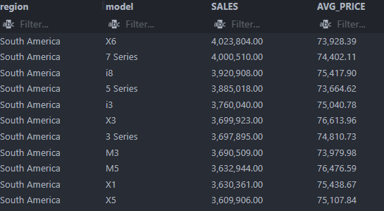

- The x6 models had the highest sales in south America with the the 7 series coming 2nd.
- The X3 series had the highest pricing and performed poorly in the sales data.
- The 5 series had the lowest pricing and was number 4 in the sales perfomance.
- X6 models and the 7 series are among the cheapest in south America, while ranking very high in the sales perfomance signifying that the South american market favours cars with lower price range.

## FUEL TYPE ANALYSIS

**Africa**  

- Petrol was the most sold fuel type in Africa, followed by the hybrid model, then electric and diesel got the lowest.

**Asia**  

- Hybrid Models sold the highest in asia, followed by the Electric models. The Diesel came 3rd with Petrol having the lowest sales. Asia has more adaptability to electric models and subsequent productions should be more of the Eco friendly models.

**Europe**

- Europe bought more Hybrid, followed by petrol. suprisenly, electric came 3rd with Diesel as the least prefered.

**Middle East**

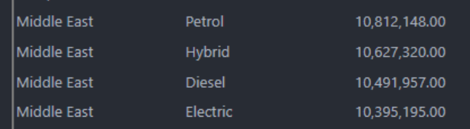

- Petrol sold the highest, followed by hybrid, Diesel and electric got the lowest sales. Middle eastern Markets are still behind in the adaptation of More Eco friendly cars.

**North America**

- North America shows a high adaptation of eco friendly models with the highest sales being the electric models followed by the hybrid -- petrol comes next and diesel comes last.

**South America**

- In south America, diesel Models comes first, followed by electric models, hybrid petrol comes last. is petrol more expensive in South america than diesel is?

## TRANSMISSION

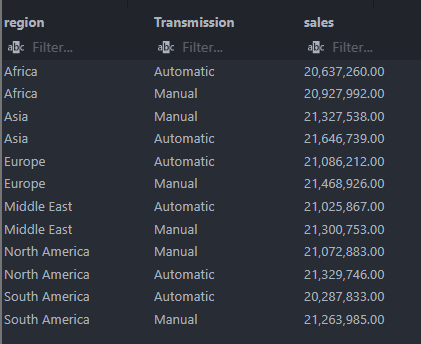

- The Automatic transamission sold more in other regions except Asia and the middle east. This may be as a result of driving habits and terrain.

## ENGINE SIZE

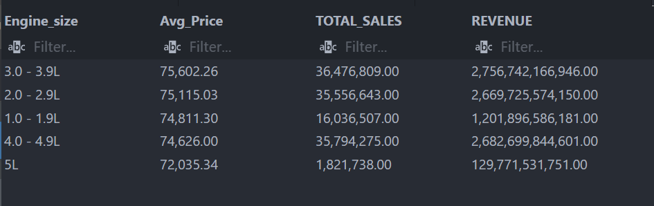

- Globally, the 3.0L -3.9L versions were the most expensive and most profitable.
- The 5l variant were cheaper and sold the least with less revenue too.
- Africa, Asia, Europe and America bought more of the 3L engines while the Middle East and North America bought more of the 4L varaints.
- The 5 L variants remains the least prefered among all the regions.

## MILEAGE

-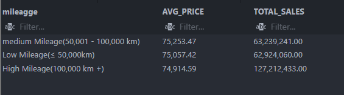

- Global overview shows that cars with lower mileage were more expensive than cars with high mileage. however most of the cars sold were those with higher mileage. This may be due to purchasing power and not preference.

## KEY INSIGHTS

## PROJECT FILES

- Data Cleaning: [Data_Cleaning_File](Data_cleaning)
- Data Exploration: [ANALYTICS_FILE](Analysis_script.sql)
- Report: [Report_file](REPORT.md)
- Summary and Key Insights: [Summary and Key Insights](KEY_INSIGHTS_AND_SUMMARY.md)

## Author

**NNaemeka Ijeoma**
